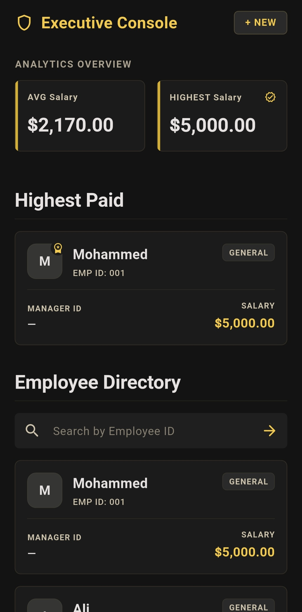
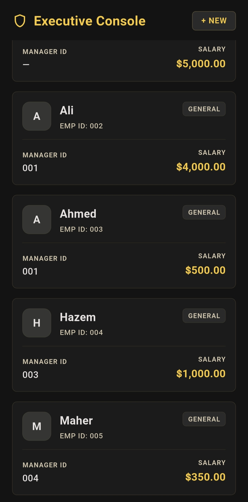
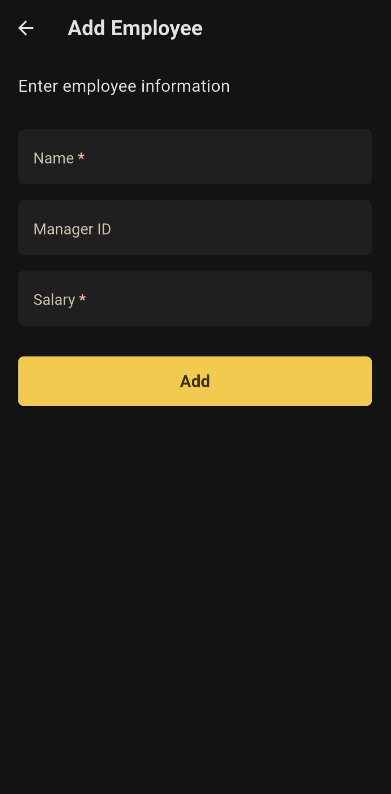

# Executive Console 🚀

A modern employee management application built with Flutter, designed around scalable architecture, RESTful API integration, state management, dependency injection, and a consistent executive-oriented user interface.

## 📖 About

Executive Console is a Flutter-based employee management application connected to a RESTful API built with ASP.NET Core and SQL Server.

The project was developed to take the Employee Management API from the backend into a real mobile application, creating a complete flow between the Flutter client and the .NET backend.

The main goal of the project was to apply practical Flutter architecture concepts while consuming a real RESTful API, rather than working with local or static data.

Throughout the development process, the application focused on concepts such as Feature-Based Architecture, BLoC/Cubit State Management, Repository Pattern, Dependency Injection, API Integration, Exception Handling, and Separation of Concerns.

---

## ✨ Features

### 👥 Employee Management

* View Employees
* View Employee Details
* Add New Employees
* Edit Existing Employees
* Delete Employees
* Employee Search
* Employee Data Validation

---

### 📊 Employee Analytics

* Total Employees
* Average Salary
* Highest Paid Employee
* Employee Salary Information
* Manager / Employee Relationships

---

### 🌐 REST API Integration

* RESTful API Communication
* HTTP GET Requests
* HTTP POST Requests
* HTTP PUT Requests
* HTTP DELETE Requests
* API Response Handling
* HTTP Status Code Handling
* Loading States
* Error States
* Repository Exception Handling

---

### 🔄 State Management

* Cubit State Management
* Loading State
* Loaded State
* Error State
* Initial State
* Reactive UI Updates

---

### 💉 Dependency Injection

* Dependency Injection using GetIt
* Centralized Dependency Registration
* Reduced Coupling Between Components

---

### 🎨 User Interface

* Executive-oriented UI
* Dark Theme
* Custom Design System
* Consistent Colors & Typography
* Reusable UI Components
* Responsive Layout
* Loading Indicators
* Error Feedback

---

## 🏗️ Architecture

The project follows a feature-based architecture with a strong focus on Separation of Concerns and maintainability.

### Architecture Stack

* Feature-Based Architecture
* BLoC / Cubit State Management
* Repository Pattern
* Dependency Injection
* Separation of Concerns
* Exception Handling

### Project Structure

```text
lib/
│
├── core/
│   ├── config/
│   ├── di/
│   ├── helpers/
│   ├── theme/
│   └── widgets/
│
├── exceptions/
│   └── repository_exception.dart
│
├── features/
│   ├── employee_form/
│   │   └── presentation/
│   │       └── screens/
│   │
│   └── executive_console/
│       ├── data/
│       │   ├── models/
│       │   └── repositories/
│       │
│       └── presentation/
│           ├── managers/
│           │   └── cubits/
│           ├── screens/
│           └── widgets/
│
└── main.dart
```

### Data Flow

```text
UI
 ↓
Cubit
 ↓
Repository
 ↓
REST API
 ↓
ASP.NET Core Web API
 ↓
SQL Server
```

This structure keeps each layer responsible for a specific part of the application and prevents API communication, state management, and UI logic from being tightly coupled.

---

## 🔌 Backend Integration

Executive Console communicates with an Employee Management RESTful API built using ASP.NET Core.

### Backend Stack

* C#
* .NET 10
* ASP.NET Core Web API
* SQL Server
* ADO.NET
* Stored Procedures
* Three-Tier Architecture

### Backend Responsibilities

The API handles:

* Employee CRUD Operations
* Employee Search
* Highest Paid Employee
* Average Salary
* Manager / Employee Relationships
* Model Validation
* SQL Server Data Access

The Flutter application consumes these endpoints and presents the data through the mobile interface.

---

## 🧠 State Management

The application uses **BLoC/Cubit** to manage application state and separate business logic from the UI.

The main states include:

```text
Initial
Loading
Loaded
Error
```

The UI reacts to state changes instead of directly handling API requests.

This keeps the presentation layer focused on displaying data and responding to user interactions.

---

## 🌐 Networking

**Dio** is used for communication with the RESTful API.

The repository layer handles the communication between the application and the backend, keeping networking logic away from the UI.

### API Flow

```text
User Interaction
      ↓
Cubit
      ↓
Repository
      ↓
Dio
      ↓
REST API
      ↓
SQL Server
```

---

## 💉 Dependency Injection

**GetIt** is used to register and resolve application dependencies.

Dependency Injection helps reduce direct dependencies between classes and makes the application's components easier to manage and replace.

The dependency registration is centralized inside the application's core configuration.

---

## ⚠️ Exception Handling

The application uses a dedicated repository exception system to handle failures coming from the data layer.

Instead of allowing API or repository errors to directly reach the UI, exceptions are handled and converted into states that the presentation layer can understand.

```text
API / Repository Error
        ↓
Repository Exception
        ↓
Cubit Error State
        ↓
UI Error Feedback
```

---

## 🎨 Design System

Executive Console uses a custom visual direction called **Executive Onyx**.

The design system is built around a dark executive-style interface with:

* Deep Charcoal Surfaces
* Metallic Gold Accents
* Electric Blue Interactive States
* Consistent Typography
* Consistent Spacing
* Subtle Borders
* Reusable UI Components

The goal was to keep the entire application visually consistent while maintaining a professional dashboard-oriented appearance.

---

## 🛠️ Tech Stack

### Framework

* Flutter

### Language

* Dart

### Architecture

* Feature-Based Architecture
* Repository Pattern
* Separation of Concerns

### State Management

* BLoC
* Cubit

### Networking

* Dio

### Dependency Injection

* GetIt

### Backend

* ASP.NET Core
* .NET 10
* RESTful API

### Database

* SQL Server

### Backend Data Access

* ADO.NET
* Stored Procedures

### API Documentation & Testing

* Swagger / OpenAPI

---

## 📦 Main Dependencies

```yaml
flutter_bloc
dio
get_it
cupertino_icons
```

---

## 📸 Screenshots

<p align="center">
  
  
  
  
</p>

---

## 🚀 Getting Started

### Prerequisites

Make sure you have:

* Flutter SDK installed
* Dart SDK compatible with the project
* A running Employee Management REST API
* Android Studio or another Flutter-compatible development environment

### Clone Repository

```bash
git clone https://github.com/HazemAttia7/Executive-Console-App.git
```

### Navigate To Project

```bash
cd Executive-Console-App
```

### Install Dependencies

```bash
flutter pub get
```

### Configure API

Make sure the Flutter application is configured to communicate with the correct Employee Management API endpoint.

### Run Application

```bash
flutter run
```

---

## 🔗 Related Backend Project

The mobile application was built to consume the Employee Management RESTful API.

**Employee Management API | ASP.NET Core + SQL Server**

The backend project implements:

* ASP.NET Core Web API
* SQL Server
* ADO.NET
* Stored Procedures
* Three-Tier Architecture
* CRUD Operations
* Employee Salary Analytics
* Model Validation

---

## 🎯 Roadmap

### Completed

* [x] Employee Directory
* [x] Employee Management
* [x] Add Employee
* [x] Edit Employee
* [x] REST API Integration
* [x] BLoC / Cubit State Management
* [x] Repository Pattern
* [x] Dependency Injection
* [x] Exception Handling
* [x] Executive Onyx Design System

### Planned

* [ ] Authentication & Authorization
* [ ] Role-Based Access
* [ ] Advanced Employee Filtering
* [ ] Employee Search Improvements
* [ ] Dashboard Analytics
* [ ] Pagination
* [ ] Additional Employee Statistics

---

## 👨‍💻 Development

Executive Console was developed as a practical Flutter project to connect a real mobile application with a custom-built .NET backend.

The project allowed me to work across both sides of the system, starting from the SQL Server database and ASP.NET Core API and ending with the Flutter mobile application.

### Development Focus

* Flutter Development
* RESTful API Integration
* State Management
* Feature-Based Architecture
* Repository Pattern
* Dependency Injection
* Separation of Concerns
* UI / UX
* .NET Backend Integration

### Project Status

* Status: Active Development
* Application: Flutter
* Backend: ASP.NET Core
* Database: SQL Server

---

## 🌟 Key Concepts Implemented

* Feature-Based Architecture
* Repository Pattern
* BLoC / Cubit State Management
* Dependency Injection
* RESTful API Integration
* Dio Networking
* Exception Handling
* Separation of Concerns
* HTTP Status Code Handling
* CRUD Operations
* API Error Handling
* SQL Server Integration
* Three-Tier Backend Architecture
* ADO.NET
* Stored Procedures
* Employee Analytics
* Responsive UI Design

---
